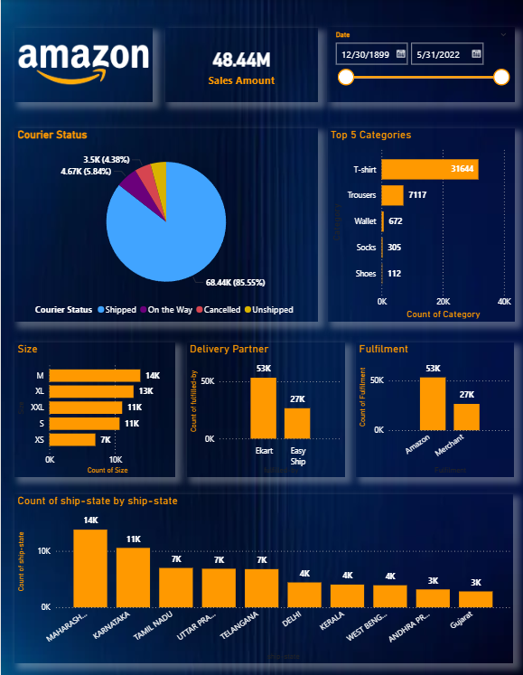

# 🛒 E-commerce Sales Performance & KPI Analytics Dashboard — Power BI



## 📌 Project Overview

This project presents an interactive **E-commerce Sales Performance & KPI Analytics Dashboard** built using **Power BI**. The dashboard analyzes over **BDT 48.44M in sales data** to track business performance, identify sales trends, evaluate logistics efficiency, and support data-driven decision-making across an e-commerce operation.

---

## 🎯 Key Metrics

| Metric | Value |
|---|---|
| Total Sales Revenue | BDT 48.44M |
| Products Analyzed | Multiple Categories |
| Delivery Partners Evaluated | Multiple Regions |
| Reporting Period | Full Year |

---

## 📊 Dashboard Features

- **Sales Performance KPIs**
  Top-level KPI cards tracking total revenue, order volume, and overall business performance at a glance

- **Sales by Product Category**
  Visual breakdown of revenue contribution across all product categories — identifying top-performing and underperforming segments

- **Logistics & Delivery Performance**
  Evaluation of delivery fulfillment rates across partners and regions — tracking on-time delivery, delays, and regional performance gaps

- **Sales Trends Over Time**
  Time-series analysis of sales patterns — identifying seasonal peaks, growth trends, and anomalies

- **Campaign Performance Analysis**
  Measurement of promotional campaign effectiveness and its impact on revenue

- **Interactive Filters & Drill-downs**
  Dynamic slicers enabling exploration by product, region, time period, and delivery partner

---

## 🛠️ Tools & Technologies

- **Power BI Desktop** — Dashboard design and interactive visualization
- **Microsoft Excel** — Data cleaning, preprocessing, and initial analysis
- **DAX (Data Analysis Expressions)** — Custom KPI measures and calculated columns
- **Power Query** — Data transformation, shaping, and modeling

---

## 💡 Key Insights

1. **Top product categories** drive a disproportionate share of total revenue — enabling focused inventory and marketing decisions
2. **Regional delivery performance** varies significantly — highlighting logistics partners needing operational improvement
3. **Seasonal sales patterns** show clear peak periods — allowing proactive stock and campaign planning
4. **Fulfillment rate analysis** reveals gaps between order volume and delivery success across specific regions
5. **Campaign data** shows measurable uplift in revenue during promotional periods

---

## 📁 Repository Structure

```
ecommerce-kpi-analytics-dashboard/
│
├── Ecommerce_KPI_Analytics_Dashboard.pbix  # Power BI dashboard file
├── preview.png                              # Dashboard screenshot
└── README.md                                # Project documentation
```

---

## 🚀 How to Use

1. Download the `.pbix` file
2. Open it in **Power BI Desktop** (free download from microsoft.com)
3. Use the interactive filters to explore sales by category, region, or time period
4. All KPI cards and visuals update dynamically based on your selections

---

## 🔗 Live Dashboard

View the published dashboard here: [Power BI Report](https://tinyurl.com/3vbcmsu4)

---

## 👤 Author

**Md Murtoza Mahir**
Data Analyst | Power BI | SQL | Python | Excel
📧 murtozamahir.info@gmail.com
🔗 [LinkedIn](https://www.linkedin.com/in/murtoza-mahir)

---

> *This project was built to demonstrate end-to-end business intelligence capabilities — from raw data processing to interactive dashboard delivery — using Power BI.*
